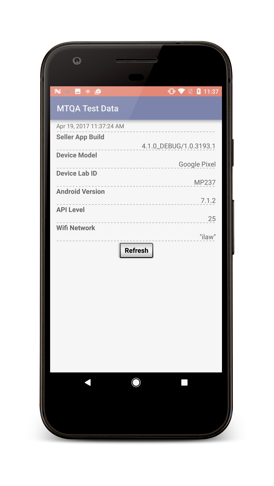

# MTQA Test Data

Android app that displays useful information for general testing and tickets.

I noticed I was spending a lot of time going to 3-4 places to pull all the information that I needed to include inside tickets. So I created an app that aggregates all of it. 

Not only useful for tickets! This info is also great when you're testing and want to confirm the os version or wifi network or build, etc. 

#### *Still adding more useful data to app.*

<h1 align="center">
	
</h1>

